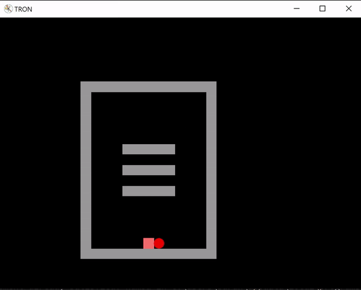

# TRON - Monte Carlo
This is a school project: based off the game TRON, a small AI has to cover as much ground as possible without hitting walls or going over the same square twice. It uses a Monte Carlo algorithm (and a Nested Monte Carlo for TronNMC.py).

